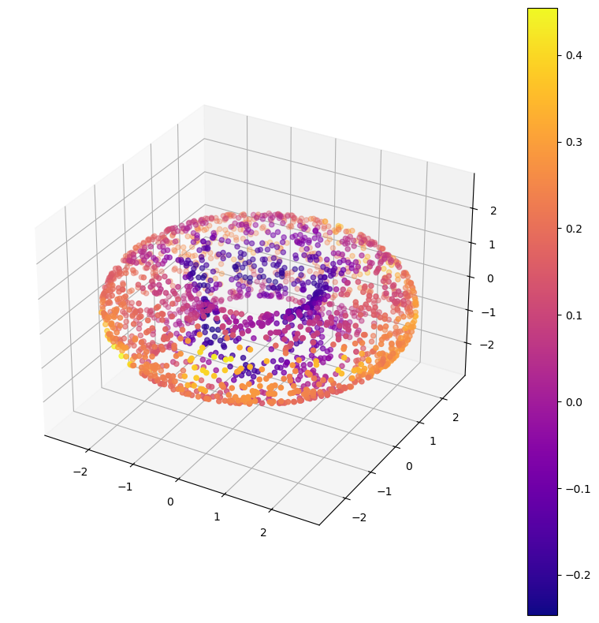
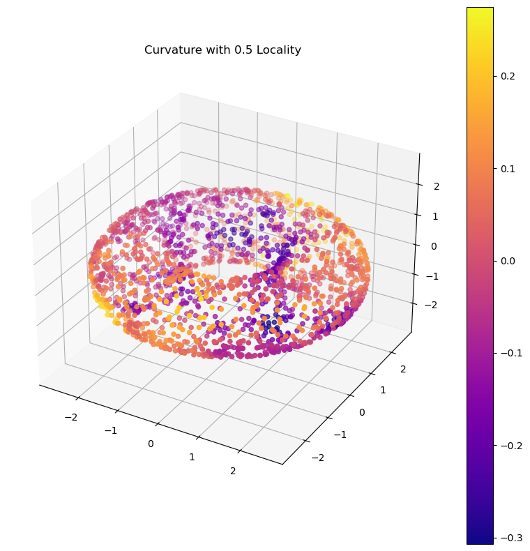
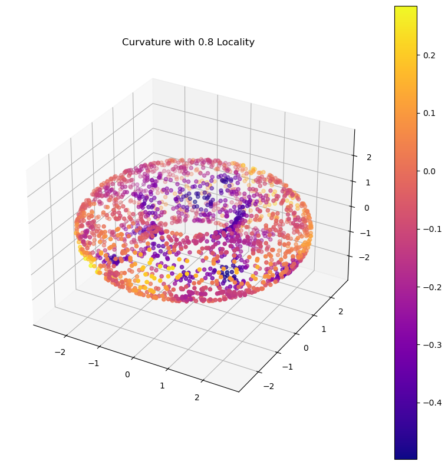
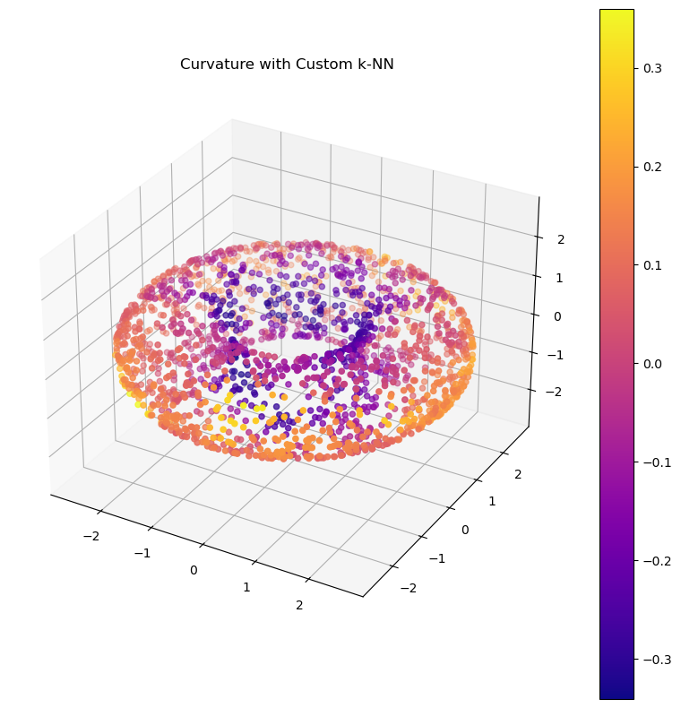
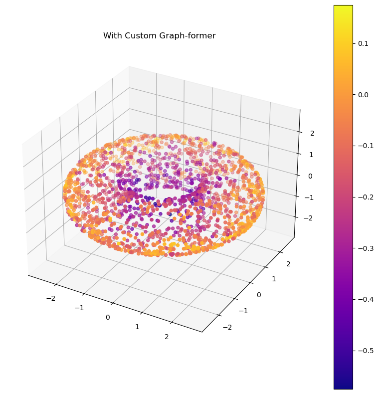
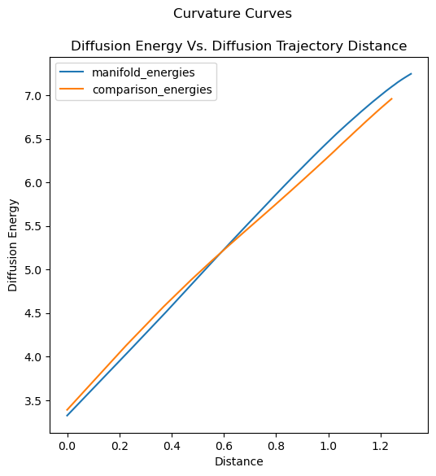
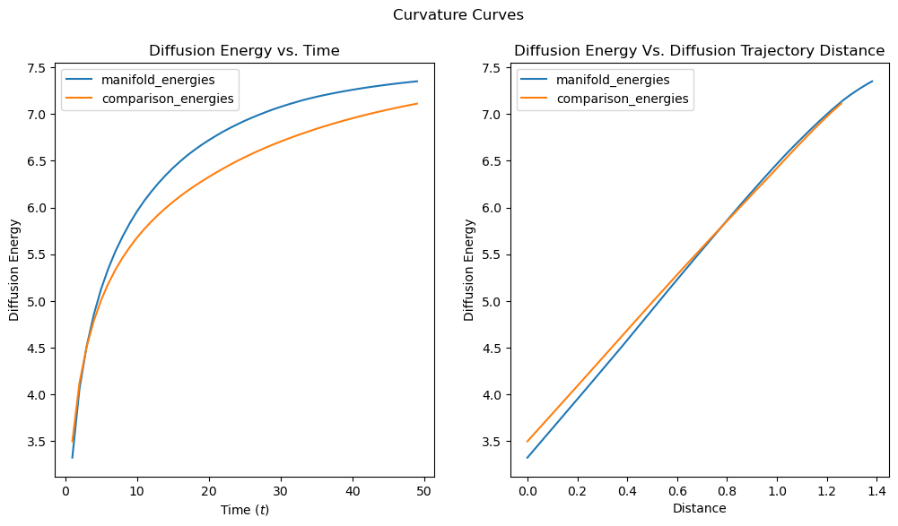

# Diffusion Curvature


<!-- WARNING: THIS FILE WAS AUTOGENERATED! DO NOT EDIT! -->

Diffusion Curvature is a pointwise extension of Ollivier-Ricci
curvature, designed specifically for the often messy world of pointcloud
data. Its advantages include:

1.  Unaffected by density fluctuations in data: it inherits the
    diffusion operator’s denoising properties.
2.  Fast, and scalable to millions of points: it depends only on matrix
    powering - no optimal transport required.

# Installation

The chief dependency is JAX, which provides a GPU-accelerated version of
numpy we use for calculating diffusion scales quickly. Visit [JAX’s
Installation
Site](https://jax.readthedocs.io/en/latest/installation.html) for
instructions on installing it with support for your GPU (CUDA, TPU, AMD,
or even Apple MPS). If you don’t have a GPU, just run
`conda/pip install jax`.

Then you can install diffusion curvature via

``` sh
pip install git+https://github.com/professorwug/diffusion-curvature.git
```

We plan to provide pip and conda packages after publication.

## Usage

Suppose you have some pointcloud, $X$, and wish to find the curvature of
each point.

``` python
X, ks = torus(use_guide_points=True)
```

Diffusion Curvature uses the scikit-learn style `fit_transform` syntax,
with only two needed inputs.

1.  An input pointcloud $X$
2.  A locality scale $l$, from 0 to 1

So, first import and instantiate the `DiffusionCurvature`, then call
`fit_transform` with your data.

``` python
from diffusion_curvature.core import DiffusionCurvature


DC = DiffusionCurvature(
    estimate_local_dimension = False, 
)

curvatures = DC.fit_transform(
    X = X,
    locality_scale = 1,
)
```

    Estimated dimension(s) in point cloud: {2}

What glorious geometric features!

``` python
plot_3d(X, curvatures)
```



As you see, `DC` has correctly estimated the intrinsic dimension of our
torus as 2. By default the parameter `estimate_local_dimension` is true,
and `DC` will perform this estimation locally for each point – which is
helpful if your pointcloud may contain many intersecting manifolds, like
single-cell data.

We can play with the `locality_scale` to see what curvature looks like
at different levels of locality.

``` python
curvatures_low_locality = DC.fit_transform(
    X = X,
    locality_scale = 0.5,
)
plot_3d(X, curvatures_low_locality, title = "Curvature with 0.5 Locality")
```

    Estimated dimension(s) in point cloud: {2}



``` python
curvatures_medium_locality = DC.fit_transform(
    X = X,
    locality_scale = 0.8,
)
plot_3d(X, curvatures_medium_locality, title = "Curvature with 0.8 Locality")
```

    Estimated dimension(s) in point cloud: {2}



You’ll note that at smaller `locality_scales`, density starts to affect
the curvature. We find that using 0.9 or 1 works for most data we’ve
tried - but we recommend trying a few values to get a feel of how the
curvature changes as one gets a broader picture of the manifold.

## Graph building

Diffusion Curvature will, by default, construct its own graph from
pointcloud data using a bespoke *curvature-agnostic kernel* You can
tailor the size of that kernel by supplying a `graph_knn` value.

Note that, unlike the tradition k-nearest neighbor kernel, this
specifies the *total* number of points with non-negligable connection
with the present point. 5-10 is usually too small.

``` python
curvatures_custom_knn = DC.fit_transform(
    X = X,
    locality_scale = 1,
    graph_knn = 38,
)
plot_3d(X, curvatures_custom_knn, title = "Curvature with Custom k-NN")
```

    Estimated dimension(s) in point cloud: {2}



If you want more control over the kernel used to construct a graph
affinity matrix, you can define your own and supply it via the
`graph_former` function. We supply a number of common kernels you can
easily adapt.

``` python
from diffusion_curvature.kernels import get_adaptive_graph, get_fixed_graph
from functools import partial

DC_with_custom_kernel = DiffusionCurvature(
    graph_former = partial(get_adaptive_graph, k = 10)
)
curvature_with_custom_kernel = DC_with_custom_kernel.fit_transform(X, dim = 2)
plot_3d(X, curvature_with_custom_kernel, title = "With Custom Graph-former")
```

    2024-08-10 12:41:54,091:[WARNING](pygsp.graphs.graph.check_weights): The main diagonal of the weight matrix is not 0!
    2024-08-10 12:41:56,458:[WARNING](pygsp.graphs.graph.check_weights): The main diagonal of the weight matrix is not 0!
    2024-08-10 12:41:57,351:[WARNING](pygsp.graphs.graph.check_weights): The main diagonal of the weight matrix is not 0!
    2024-08-10 12:41:58,233:[WARNING](pygsp.graphs.graph.check_weights): The main diagonal of the weight matrix is not 0!



You’ll notice that the scale of curvature varies somewhat between
kernels. We find that common kernels (particularly the adaptive kernel)
actually disguise data geometry, and for this reason recommend using our
curvature-agnostic kernel.

## Curvature Curves

Under the hood, Diffusion Curvature performs many scales of graph
diffusion on (1) the given pointcloud, and (2) a set of comparison
samples from Euclidean space of the given dimension. It then measures
the ‘Diffusion Energy’ of those scales, and by comparing the energy of
the given manifold to the comparison space, produces a curvature.

We can visualize this comparison with a set of curves:

``` python
from diffusion_curvature.diffusion_laziness import curvature_curves
DC = DiffusionCurvature()
curvatures = DC.fit_transform(X, dim = 2, locality_scale=1)
manifold_energies = DC.manifold_lazy_est
comparison_energies = DC.comparison_lazy_est
curvature_curves(
    manifold_energies, comparison_energies, also_plot_against_time=False, 
    idx=1
    )
```



``` python
from diffusion_curvature.diffusion_laziness import curvature_curves
DC = DiffusionCurvature(smoothing = 2)
curvatures = DC.fit_transform(X, dim = 2, locality_scale=0.9, ts = list(range(1,50)),graph_knn = 150)
manifold_energies = DC.manifold_lazy_est
comparison_energies = DC.comparison_lazy_est
curvature_curves(
    manifold_energies, comparison_energies, also_plot_against_time=True, 
    idx=1
    )
```



Index 1 on the torus is in the negatively curved ‘donut hole’. Here we
see that, for later scales, the energy of diffusion in this donut hole
is greater than on the plane. Notably, the same is not true for lower
distances.

The parameter `locality_scale` selects the fraction of the maximum
distance you wish to use. `1` corresponds to the largest possible
(around 1.2 here), while `0.5` gets $1.2 \times 0.5 = 0.6$.

## Development Installation

This project is packaged with [Pixi](https://pixi.sh), a modern
Poetry-like package manager from the makers of Mamba that supports both
pip and conda packages. To install the dependencies and get the project
running, follow these steps:

1.  Install [Pixi](https://pixi.sh) with `brew install pixi` or (for the
    brave) `curl -fsSL https://pixi.sh/install.sh | bash`.
2.  Run `pixi install` in the project root. This installs both the
    dependencies and the `diffusion_curvature` package itself.
3.  Run `pixi run postinstall` to install a jupyter kernel and nbdev’s
    git hooks (which erase troublesome notebook metadata to prevent git
    conflicts)

To access Pixi’s virtual environment, run `pixi shell` in the project
root, or (if you have a python script), run
`pixi run python my_script.py`.
