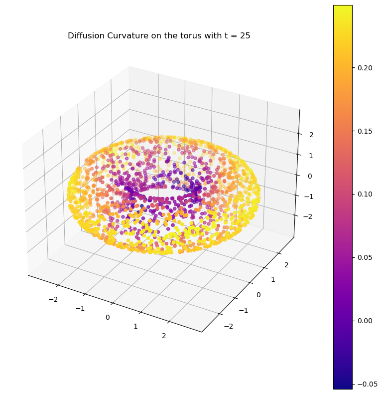
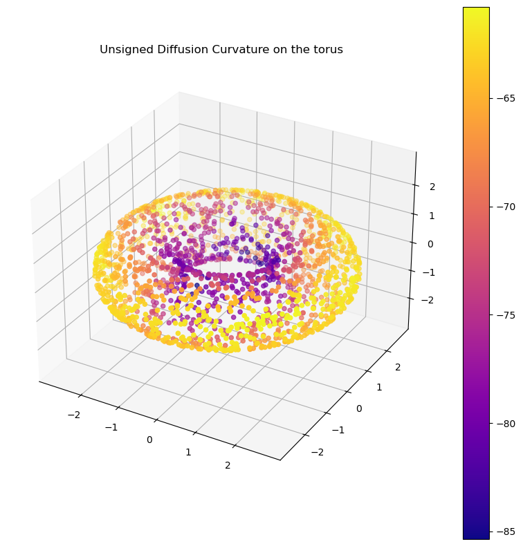

# Diffusion Curvature


<!-- WARNING: THIS FILE WAS AUTOGENERATED! DO NOT EDIT! -->

> \[!INFO\] This code is currently in *early beta*. Some features,
> particularly those relating to dimension estimation and the
> construction of comparison spaces, are experimental and will likely
> change. Please report any issues you encounter to the Github Issues
> page.

Diffusion curvature is a pointwise extension of Ollivier-Ricci
curvature, designed specifically for the often messy world of pointcloud
data. Its advantages include:

1.  Unaffected by density fluctuations in data: it inherits the
    diffusion operator’s denoising properties.
2.  Fast, and scalable to millions of points: it depends only on matrix
    powering - no optimal transport required.

## Development Installation

This project is packaged with [Pixi](https://pixi.sh), a modern
Poetry-like package manager from the makers of Mamba that supports both
pip and conda packages. To install the dependencies and get the project
running, follow these steps:

1.  Install [Pixi](https://pixi.sh) with `brew install pixi` or (for the
    brave) `curl -fsSL https://pixi.sh/install.sh | bash`.
2.  Run `pixi install` in the project root. This installs both the
    dependencies and the `diffusion_curvature` package itself.
3.  Run `pixi run postinstall` to install a jupyter kernel and nbdev’s
    git hooks (which erase troublesome notebook metadata to prevent git
    conflicts)

To access Pixi’s virtual environment, run `pixi shell` in the project
root, or (if you have a python script), run
`pixi run python my_script.py`.

## Usage

Diffusion Curvature uses scikit-learn style `fit_transform` syntax, with
one subtlety: you must pass both a *graph* and a *graph former* (the
function that created the graph).

``` python
from diffusion_curvature.core import DiffusionCurvature, get_adaptive_graph, get_fixed_graph
from functools import partial
```

You can customize your ‘graph former’ using `partial`, like this. We
supply two graph forming functions, `get_fixed_graph` (which uses a
standard gaussian kernel), and `get_adaptive_graph` (which adaptively
sets the kernel bandwidth at each point based on the distance to the kth
nearest neighbor). For accurately computing signed curvatures, we
recommend using `get_fixed_graph` and tuning the bandwidth yourself to
the data, as adaptively tuned bandwidths make comparing between spaces
of different curvature hard.

``` python
# graph_former = partial(get_fixed_graph, sigma = None, alpha = 1)
graph_former = partial(get_adaptive_graph, alpha = 1)
```

Which can then be easily applied to data

``` python
X_torus, ks_torus = torus(2000)
G_torus = graph_former(X_torus)
```

    2024-04-18 13:09:32,185:[WARNING](pygsp.graphs.graph.check_weights): The main diagonal of the weight matrix is not 0!

Curvature is computed by the `DiffusionCurvature` class. All of the
defaults are sane.

The only thing you need to pass at initialization is your graphformer.

``` python
DC = DiffusionCurvature(
    graph_former=graph_former
)
```

To get curvature, call `.fit_transform` and supply the intrinsic
dimension (or a guess at it).

``` python
ks = DC.fit_transform(G_torus, dim=2) # note: this is the *intrinsic* dimension of the data
```

    2024-04-18 13:09:42,787:[WARNING](pygsp.graphs.graph.check_weights): The main diagonal of the weight matrix is not 0!

``` python
plot_3d(X_torus, ks, colorbar=True, title=f"Diffusion Curvature on the torus with t = {DC.t}")
```



The main parameter in the algorithm is $t$, the diffusion time. Roughly
speaking, $t$ controls the scale at which curvature is measured.

You might have noticed that we never supplied $t$ above. Fear not —— if
left blank, Diffusion Curvature estimates the best $t$ by looking at the
entropy of the eigenvalues of the diffusion matrix over time. You can
see what it finds with:

``` python
DC.t
```

    25

We recommend playing with this value.

In some situations, an *unsigned* curvature is preferable — and much
easier computationally. To get this, just pass `unsigned=True`.

``` python
ks = DC.fit_transform(G_torus, t=25, dim=2, unsigned=True)
```

``` python
plot_3d(X_torus, ks, colorbar=True, title="Unsigned Diffusion Curvature on the torus")
```



Don’t be alarmed if the signs here are negative. The higher numbers are
more positively curved, the lower more negatively curved.
