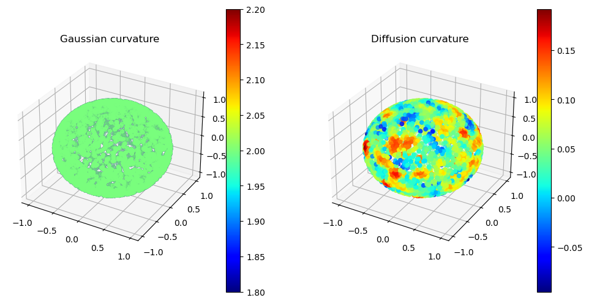

# Examples

<!-- WARNING: THIS FILE WAS AUTOGENERATED! DO NOT EDIT! -->

``` python
from diffusion_curvature.datasets import *
from diffusion_curvature.core import *
from diffusion_curvature.core import DiffusionCurvature, get_adaptive_graph
from diffusion_curvature.kernels import *
import matplotlib.pyplot as plt
import numpy as np
import graphtools
```

``` python
def visualize_2_curvatures(X,k1,k2):
    """Makes two side-by-side 3d plots of X, the first colored by k1, the second by k2. A colorbar accompanies each."""
    fig = plt.figure(figsize=(12,6))
    ax1 = fig.add_subplot(121, projection='3d')
    ax2 = fig.add_subplot(122, projection='3d')
    ax1.scatter(X[:,0], X[:,1], X[:,2], c=k1, cmap='jet')
    ax2.scatter(X[:,0], X[:,1], X[:,2], c=k2, cmap='jet')
    ax1.set_title('Gaussian curvature')
    ax2.set_title('Diffusion curvature')
    fig.colorbar(ax1.scatter(X[:,0], X[:,1], X[:,2], c=k1, cmap='jet'), ax=ax1)
    fig.colorbar(ax2.scatter(X[:,0], X[:,1], X[:,2], c=k2, cmap='jet'), ax=ax2)
    plt.show()
```

For the hyperboloid, we found these parameters to be most impactful:

- `anisotropy=1`, when constructing the Graphtools graph. This combats
  some of the fluctuations in curvature caused by local density
  variations.
- `knn=10`: large enough to allow diffusion to cover the graph, local
  enough to capture the curvature

Note that our pointcloud, unlike the ideal hyperboloid, cuts off at the
top and bottom, causing diffusion to rebound and giving the impression
of higher curvatures.

``` python
X_hyperboloid, ks_hyperboloid = hyperboloid(3000)
G_hyperboloid = get_adaptive_graph(X_hyperboloid) # graphtools.Graph(X_hyperboloid, knn=10, anisotropy=1)
DC = DiffusionCurvature()
G_hyperboloid = DC.curvature(G_hyperboloid, dim=2, t=25)
visualize_2_curvatures(X_hyperboloid, ks_hyperboloid, G_hyperboloid.ks)
```

    2023-12-19 19:03:52.481334: W external/xla/xla/service/platform_util.cc:198] unable to create StreamExecutor for CUDA:0: failed initializing StreamExecutor for CUDA device ordinal 0: INTERNAL: failed call to cuDevicePrimaryCtxRetain: CUDA_ERROR_OUT_OF_MEMORY: out of memory; total memory reported: 25370427392
    CUDA backend failed to initialize: INTERNAL: no supported devices found for platform CUDA (Set TF_CPP_MIN_LOG_LEVEL=0 and rerun for more info.)

    AttributeError: 'ArrayImpl' object has no attribute 'ks'

As the sphere shows,

``` python
X_sphere, ks_sphere = sphere(3000)
G_sphere = graphtools.Graph(X_sphere, knn=15, anisotropy=1)
DC = DiffusionCurvature(t=15)
G_sphere = DC.curvature(G_sphere,dimension=2)
visualize_2_curvatures(X_sphere, ks_sphere, G_sphere.ks)
```



# Pure Graphs

Diffusion curvature was designed for pointclouds, and it’s in this
domain that it shows the clearest advantages over competing methods,
like Ollivier Ricci curvature. But it can also be used directly on an
adjacency matrix. Here’s how:
